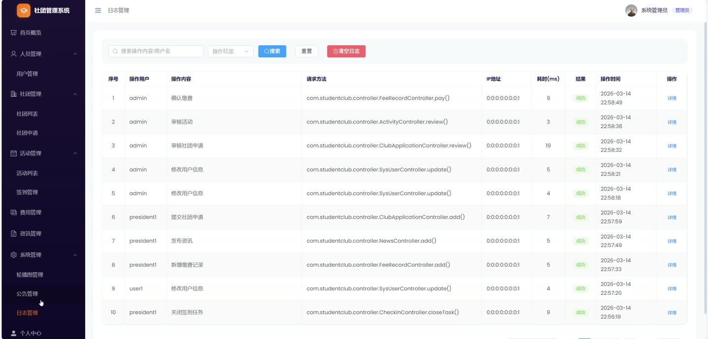

# (附文档)Springboot3+Vue3+MySQL 学生社团管理系统

**技术栈**：Springboot3、Vue3、MySQL

### 系统简介

本系统为基于 Spring Boot 3 + Vue 3 + MySQL 的社团管理平台，采用前后端分离架构，支持普通学生、社团管理员（社长）、系统管理员三种角色。系统提供社团创建与注销申请、活动发布与报名、签到打卡、缴费管理、资讯公告、轮播图配置、操作日志审计等完整功能，覆盖社团日常运营的全流程管理。
 
### 核心功能
 
### 普通用户端

 
- 查看社团列表（支持按名称关键词、分类筛选），查看社团详情（含简介、成员数、成立日期、状态）。 
- 提交入团申请（填写申请理由），查看本人入团申请列表及审核状态（待审核/通过/驳回）。 
- 查看已发布的活动列表（仅展示审核通过的活动），按活动标题关键词、所属社团筛选。 
- 报名活动（需为活动所属社团的活跃成员），查看本人报名记录（含活动标题、时间、地点、审核状态）。 
- 取消已报名的活动（同步更新活动参与人数）。 
- 查看本人签到记录（含签到任务标题、签到时间），查看当前可签到的活跃任务列表。  
- 使用签到码进行签到打卡（校验签到码、签到时间范围、是否重复签到）。 
- 查看本人缴费记录（含缴费类型、金额、状态、所属社团）。 
- 浏览已发布的社团资讯（按关键词、分类筛选），查看资讯详情（含正文、发布时间）。 
- 查看系统公告列表（仅显示启用的公告），查看轮播图（仅显示启用的轮播项）。 
- 修改个人资料（用户名、真实姓名、学号、手机号、邮箱），修改登录密码（需提供旧密码验证）。
 
### 管理员端

 
- 用户管理：查看用户列表（支持按关键词/角色筛选），新增用户（设置初始密码），编辑用户信息，删除用户。 
- 社团管理：查看社团列表（支持按名称/分类/状态筛选），审核社团状态（激活/停用/解散），删除社团。 
- 社团申请审核：查看创建社团和解散社团的申请列表（按类型/状态筛选），审核申请（通过/驳回，填写审核意见）。审核通过创建申请时自动创建社团、将申请人设为社长并添加为成员；审核通过解散申请时更新社团状态为已解散。 
- 活动管理：查看所有活动列表（支持按关键词/状态/所属社团筛选），审核活动状态（通过/驳回），删除活动。 
- 活动报名管理：查看活动的报名列表（按活动/状态筛选），审核报名状态（通过/驳回），同步更新活动当前参与人数。 
- 资讯管理：查看资讯列表（支持按关键词/分类/状态/所属社团筛选），审核资讯状态（发布/驳回），删除资讯。 
- 轮播图管理：查看轮播图列表（按排序顺序），新增/编辑轮播图（图片URL、跳转链接、排序值、启用状态），删除轮播图。 
- 系统公告管理：查看公告列表（按关键词搜索），新增/编辑公告（标题、内容、启用状态），删除公告。 
- 操作日志审计：查看操作日志列表（按关键词/操作结果筛选），清空全部日志。 
- 数据统计：查看仪表盘总览（用户总数、社团总数、活动总数、待审核活动数），查看社团分类统计（各分类社团数量），查看近6个月活动月度统计。
 
### 教练端（社长端）

 
- 管理本社团信息：编辑社团名称、简介、分类、Logo、状态。 
- 成员管理：查看本社团成员列表（按关键词搜索），手动添加成员（指定用户），移除成员。 
- 入团申请审核：查看申请加入本社团的申请列表（按状态筛选），审核申请（通过/驳回，填写审核意见），通过后自动添加为社团成员。 
- 活动管理：为本社团发布活动（填写标题、描述、地点、开始/结束时间、最大参与人数），编辑活动信息，删除活动。 
- 签到任务管理：为本社团创建签到任务（关联活动、标题、签到码、开始/结束时间），编辑任务信息，关闭任务（停止签到），删除任务。 
- 查看本社团签到记录（按任务筛选），查看签到统计（每个任务的已签到人数）。 
- 缴费管理：为本社团新增缴费记录（指定缴费用户、缴费类型、金额、缴费月份），编辑记录，确认缴费（标记为已缴费），删除记录。 
- 查看本社团缴费统计（总金额、已缴费/未缴费笔数）。 
- 提交社团解散申请（填写解散原因），查看本人提交的社团申请历史及审核状态。 
- 为本社团发布资讯（填写标题、分类、正文），编辑资讯，删除资讯。
 
### 技术栈

 后端框架Spring Boot 3.x ORMMyBatis-Plus 权限控制Spring Security + JWT 前端框架Vue 3 (Composition API) 状态管理Pinia 构建工具Vite 数据库MySQL 8.x 分页插件MyBatis-Plus Pagination 文件上传MultipartFile + 本地存储
 
### 交付内容

 
- 后端完整源码 
- 前端完整源码 
- 数据库初始化脚本 
- 万字文档

## 界面展示

---

## 获取完整源码 + 万字文档

本仓库为项目介绍页。**完整前后端源码、数据库初始化脚本、万字项目文档**，请加微信 `kangkangcode`，或访问 [codekk.top](http://codekk.top) 获取。

可作课程设计 / 毕业设计参考，支持远程部署调试。